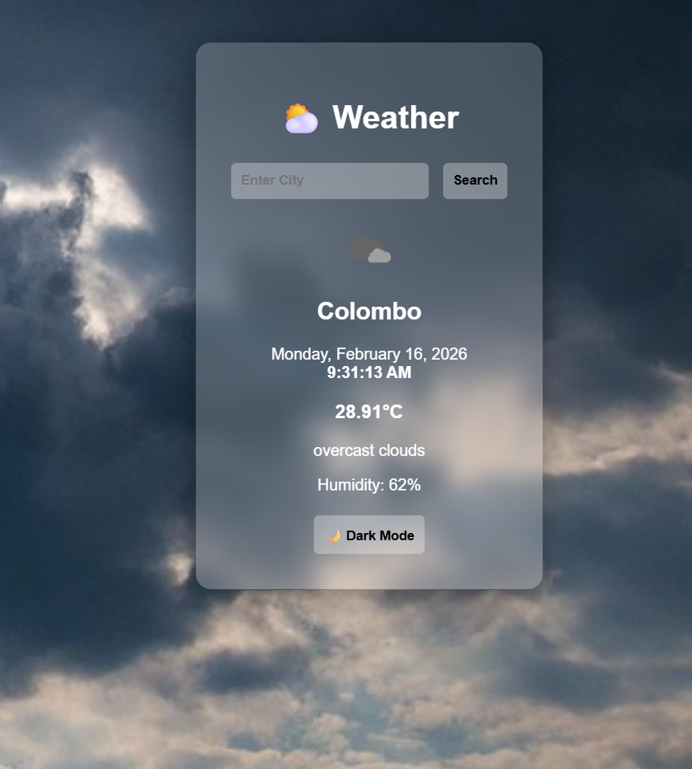

# Weather App 🌦️

A **modern dynamic weather dashboard** built with **Python (Flask)**.  
Shows real-time weather, local time for searched cities and transparent UI.

---

## Features

- Display **current weather** for any city (temperature, humidity, description).  
- **Dynamic weather icons**: sun, clouds, overcast, rain, snow.  
- **Local time & date** for each searched location.    
- **Modern UI** with background image, transparent frosted-glass container and responsive design.  
- Fully customizable CSS and icons.

---

## Screenshots

 
---

