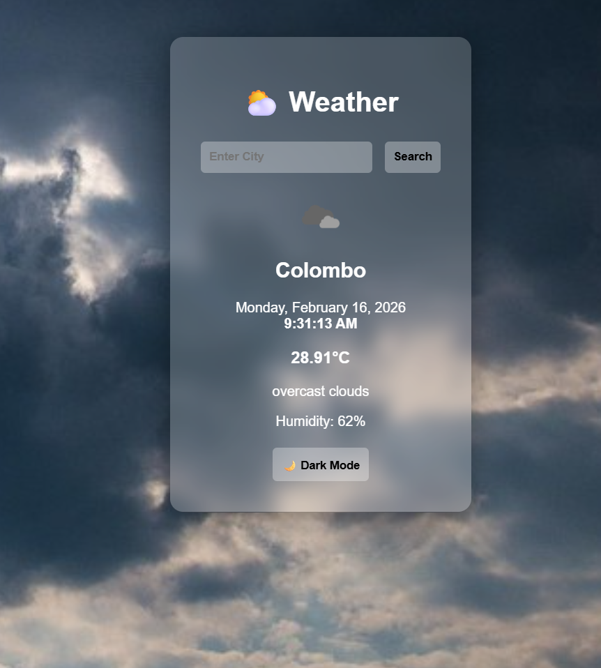

# Weather App 🌦️

A **modern dynamic weather dashboard** built with **Python (Flask)**.  
Shows real-time weather, local time for searched cities and transparent UI.

---

## Features

- Display **current weather** for any city (temperature, humidity, description).  
- **Dynamic weather icons**: sun, clouds, overcast, rain, snow.  
- **Local time & date** for each searched location.    
- **Modern UI** with background image, transparent frosted-glass container and responsive design.  
- Fully customizable CSS and icons.

---

## 🛠️ Technologies Used
- Python (Flask)
- HTML, CSS, JavaScript
- OpenWeather API

## ⚙️ Setup Instructions

1. Clone the repository
   
   ```bash
   git clone https://github.com/your-username/weather-app.git
   ```

2. Navigate to project folder

```bash
   cd weather-app
```
3. Create virtual environment

```bash
   python -m venv venv
```
4. Activate environment

```bash
   Windows:
   venv\Scripts\activate
```
5. Install dependencies

```bash
   pip install -r requirements.txt
```
6. Create .env file

```bash
   Add your API key:
   API_KEY=your_api_key_here
```
8. Run the app

```bash
   python app.py
```
9. Open browser

```bash
   http://127.0.0.1:5000/
```
## Screenshots

 
---

